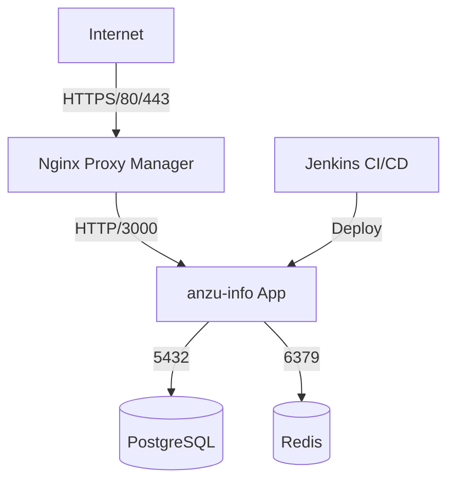

# Anzu Info 포터블 백엔드

SOUND VOLTEX 플레이 데이터를 관리하는 NestJS 기반 REST API 서버입니다.

---

## 기술 스택

| 영역 | 기술 |
|------|------|
| 런타임 | Node.js 22, NestJS |
| 데이터베이스 | PostgreSQL 17 |
| 캐시 | Redis 7 |
| ORM | Prisma 6 |
| 인프라 | Docker Compose, Jenkins |

---

## 프로젝트 구조

```
.
├── src/
│   ├── modules/
│   │   ├── auth/          # JWT 인증
│   │   ├── account/       # 계정 관리
│   │   ├── playdata/      # 플레이 데이터 (VF, 랭킹 등)
│   │   └── chart/         # 곡/채보 데이터, Redis 캐시
│   └── common/            # 공통 유틸, Redis 서비스
├── prisma/                # 스키마 및 마이그레이션
├── docker/
│   ├── dumps/             # DB·Redis 덤프 파일 보관
│   ├── restore.sh         # Linux 덤프 복구 스크립트
│   └── restore.ps1        # Windows 덤프 복구 스크립트
├── deploy.sh              # Linux 원커맨드 배포
├── deploy.ps1             # Windows 원커맨드 배포
├── docker-compose.yml
└── Jenkinsfile
```

---

## 환경 변수 설정 (`.env`)

```env
POSTGRES_USER=
POSTGRES_PASSWORD=
POSTGRES_DB=

DATABASE_URL="postgresql://:@127.0.0.1:5432/"
SECRET_KEY=

DB_HOST=localhost          # 원격 배포 시 → 서버 IP
DB_REDIS_PORT=
DB_REDIS_PASSWORD=

AWS_REGION=ap-northeast-2
AWS_ACCESSKEYID=...
AWS_SECRETACCESSKEY=...
AWS_BUCKET=anzuinfo

SWAGGER_USER=
SWAGGER_PASSWORD=
```

---

## 로컬 개발 실행

```bash
# 1. 의존성 설치
npm install

# 2. Docker 인프라 기동
docker compose up -d postgres redis

# 3. Prisma 클라이언트 생성 & 마이그레이션
npx prisma generate
npx prisma migrate dev --name init

# 4. 서버 실행
npm run start
```

- API: `http://localhost:3000`
- Swagger: `http://localhost:3000/api/docs`

---

## 배포

### 원커맨드 배포 (Linux 서버)

```bash
chmod +x deploy.sh

# 배포만
./deploy.sh

# DB + Redis 복구 포함 (최초 배포 or 데이터 이관)
./deploy.sh --pg-dump anzu_backup.backup --redis-dump redis_backup.rdb

# 이미지 새로 빌드 포함
./deploy.sh --build --pg-dump anzu_backup.backup --redis-dump redis_backup.rdb
```

### 원커맨드 배포 (Windows)

```powershell
# 배포만
.\deploy.ps1

# DB + Redis 복구 포함
.\deploy.ps1 -PgDump anzu_backup.backup -RedisDump redis_backup.rdb

# 이미지 새로 빌드 포함
.\deploy.ps1 -Build -PgDump anzu_backup.backup -RedisDump redis_backup.rdb
```

> 덤프 파일은 `docker/dumps/` 폴더에 위치해야 합니다.

---

## Jenkins 자동 배포 설정 (최초 1회)

1. `docker compose up -d jenkins`
2. `http://서버IP:8080` 접속
3. 초기 비밀번호 확인:
   ```bash
   docker exec anzu-jenkins cat /var/jenkins_home/secrets/initialAdminPassword
   ```
4. **New Item → Pipeline → GitHub 저장소 연결 → Jenkinsfile 경로 지정**
5. Jenkins Credentials에 `ADMIN_ID`, `ADMIN_PW` 등록 (캐시 초기화용)

이후 **git push** 시 자동으로 빌드 → 배포 → 마이그레이션 → 캐시 초기화가 실행됩니다.

---

## 무료 HTTPS (SSL) 자동 갱신 설정 (Nginx Proxy Manager)

`docker-compose` 배포 시 함께 실행되는 **Nginx Proxy Manager(NPM)**를 통해 웹 UI에서 쉽게 no-ip 무료 도메인 연결 및 Let's Encrypt 무료 SSL 인증서 발급이 가능합니다.

1. **NPM 웹 관리자 접속:** `http://서버IP:81`
2. **초기 로그인:**
   - Email: `admin@example.com`
   - Password: `changeme`
   - (접속 직후 본인의 이메일과 비밀번호로 변경하세요)
3. **도메인 연결 및 SSL 발급 (Proxy Hosts):**
   - 상단 메뉴 **Hosts** -> **Proxy Hosts** -> **Add Proxy Host** 클릭
   - **Details 탭:**
     - Domain Names: 소유한 도메인 (예: `my-api.ddns.net`)
     - Scheme: `http`
     - Forward Hostname / IP: `app` (Docker 컨테이너 망 내의 이름)
     - Forward Port: `3000`
     - 체크박스 3개 켜기 (Cache Assets, Block Common Exploits, Websockets Support)
   - **SSL 탭:**
     - SSL Certificate: `Request a new SSL Certificate`
     - Force SSL, HTTP/2 Support 체크
     - Email Address: 본인 이메일 입력
     - `I Agree to the Let's Encrypt Terms of Service` 체크
   - **[Save]** 클릭
4. 완료 후 10초~20초 뒤부터 `https://당신의도메인` 으로 안전하게 서비스 접속이 가능해집니다. 인증서 갱신은 만료 전 자동으로 이루어집니다.

---

## DB 덤프 복구 (단독 실행)

```bash
# PostgreSQL 복구
bash docker/restore.sh anzu_backup.backup

# Redis 복구
bash docker/restore.sh redis_backup.rdb
```

```powershell
# Windows
.\docker\restore.ps1 -DumpFile anzu_backup.backup
.\docker\restore.ps1 -DumpFile redis_backup.rdb
```

---

## Prisma 마이그레이션 관리

```bash
# 마이그레이션 상태 확인
npx prisma migrate status

# 새 마이그레이션 적용 (개발)
npx prisma migrate dev --name <이름>

# 프로덕션 마이그레이션 적용
npx prisma migrate deploy

# Prisma Studio (DB GUI)
npx prisma studio
```

---

## Redis 캐시 초기화

서버 최초 실행 또는 곡 데이터 업데이트 후 반드시 실행:

```
GET  /chart/cache   → 채보 인덱스 캐시 (관리자 전용)
POST /chart/meta    → 곡 메타 데이터 캐시 (관리자 전용)
```

---

## 주요 API 엔드포인트

| 그룹 | 엔드포인트 | 설명 |
|------|-----------|------|
| Auth | `POST /auth/login` | 로그인 (JWT 발급) |
| Auth | `POST /auth` | 회원가입 |
| Playdata | `POST /playdata/auto` | 플레이 데이터 자동 갱신 |
| Playdata | `GET /playdata/volforce` | VF 상위 50개 조회 |
| Playdata | `GET /playdata/level/:level` | 레벨별 기록 조회 |
| Playdata | `GET /playdata/rank/chart/:chartIdx` | 차트 랭킹 |
| Chart | `GET /chart/meta` | 전체 곡 메타 데이터 |
| Chart | `GET /chart/random` | 랜덤 채보 |

---

## 아키텍처 다이어그램 (운영 환경)



> **아키텍처 참고자료**: 1GB RAM 서버 스펙의 제약으로 인해, 현재 자체 서버 내 배포(`npm ci`, `docker build` 등) 과정에서 순간적인 메모리 부족 및 성능 저하가 발생할 수 있습니다. 장기적으로는 외부 CI망에서 이미지를 빌드한 뒤 본 배포 서버에서는 `pull & up`만 수행하도록 빌드/배포 환경 분리 구조 개선을 고려하는 것이 안전합니다.

## 운영 및 유지보수 가이드

### 1. Swap 메모리 설정 (1GB RAM 필수)

서버 빌드 시 OOM(Out Of Memory)로 인한 강제 종료를 방지하기 위해 호스트 OS(Ubuntu)에 2GB의 Swap(가상) 메모리를 반드시 셋팅해야 합니다.

```bash
# 2GB Swap 공간 생성 및 할당
sudo fallocate -l 2G /swapfile
sudo chmod 600 /swapfile
sudo mkswap /swapfile
sudo swapon /swapfile

# 서버 재부팅 시에도 자동 적용되도록 fstab 등록
echo '/swapfile none swap sw 0 0' | sudo tee -a /etc/fstab

# Swap 우선순위 최소화 (RAM을 최대한 우선 사용하도록 설정)
sudo sysctl vm.swappiness=10
echo 'vm.swappiness=10' | sudo tee -a /etc/sysctl.conf
```

### 2. 정기적인 Docker 딥클린 (Cron 자동화)

Jenkins 파이프라인의 `Docker Cleanup` 단계는 안전을 위해 사용하지 않는 "dangling" 이미지만 제거(`docker image prune -f`)합니다. 하지만 잦은 빌드로 인해 빌더 캐시나 더티 파일이 계속 쌓여 디스크를 차지할 수 있으므로, 주기적으로 호스트 서버에서 강력한 딥 클린을 수행하는 것이 좋습니다.

```bash
sudo crontab -e
```
아래 내용을 추가하여 매일 새벽 3시에 미사용 시스템 캐시와 이미지, 볼륨을 전부 청소합니다:
```bash
0 3 * * * docker system prune -af --volumes
```

### 3. Prisma Studio 접속 (수동 디버깅 전용)

운영 환경에서는 자원 최적화와 DB 보안을 위해 **Prisma Studio가 기본적으로 기동되지 않습니다** (`profiles: ["debug"]` 설정). 
DB 관리가 필요할 때만 터미널에서 수동으로 스튜디오를 별도 기동해야 합니다.

```bash
# Prisma Studio 임시 구동
docker-compose --profile debug up -d prisma-studio

# 작업 완료 후 보안 및 리소스 정리를 위해 스튜디오 종료
docker-compose --profile debug stop prisma-studio
```
